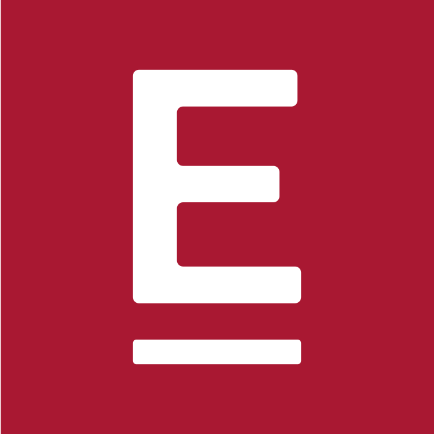
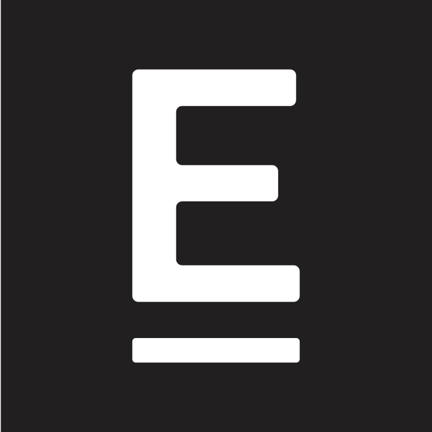

# Referencia: Logos Oficiales ENAE

Los logos SVG oficiales están incluidos en la skill en `assets/logos/`.

---

## Catálogo de logos oficiales

| Archivo                      | Descripción                                      | Uso principal                              |
|------------------------------|--------------------------------------------------|--------------------------------------------|
| `LOGO_ENAE_HORIZONTAL.svg`   | Logo horizontal compacto — ENAE + tagline + línea | Cabeceras, documentos, firmas email        |
| `ENAE_Color.svg`             | Logo completo A3/display — ENAE grande + tagline completo "International Business School" | Portadas, materiales principales en blanco |
| `ENAE_Negro.svg`             | Igual que ENAE_Color pero en negro `#221f20`     | Impresión monocromo, documentos B&N        |
| `SIMBOLO_ENAE_FONDO_ROJO.svg`| Símbolo "E" + barra blanca sobre fondo granate cuadrado | Avatares, iconos, backgrounds granate    |
| `SIMBOLO_ENAE_FONDO_NEGRO.svg`| Símbolo "E" + barra blanca sobre fondo negro cuadrado | Avatares, iconos, backgrounds oscuros   |

---

## Análisis técnico de cada logo

### `LOGO_ENAE_HORIZONTAL.svg`
- **ViewBox**: `0 0 370.4 127.12` — formato horizontal apaisado
- **Color**: granate `#a91832` sobre fondo transparente
- **Contenido**: Letras ENAE grandes + tagline "International Business School" + línea vertical separadora fina (`rect` de 1.57px ancho) + texto secundario "nternacional Business School" en pequeño
- **Uso ideal**: cabeceras de documentos, firmas de email, pie de presentaciones, cartas corporativas
- **Fondo recomendado**: blanco o muy claro

### `ENAE_Color.svg`
- **ViewBox**: `0 0 841.89 595.28` — formato A4 landscape (para display grande)
- **Color**: granate `#a81832` sobre fondo transparente
- **Contenido**: ENAE en letras grandes + "International Business School" + tagline extendido (texto secundario "nternacional Business School" completo con todas sus palabras en pequeño debajo)
- **Uso ideal**: portadas de presentaciones, materiales impresos principales, documentación formal en fondo blanco
- **Nota**: es el logo de mayor tamaño/detalle — usar cuando haya espacio suficiente

### `ENAE_Negro.svg`
- **ViewBox**: `0 0 841.89 595.28` — mismo formato que ENAE_Color
- **Color**: negro `#221f20` sobre fondo transparente
- **Contenido**: idéntico a ENAE_Color pero en versión negro
- **Uso ideal**: impresión en blanco y negro, documentos formales monocromo, fax, fotocopias
- **Fondo recomendado**: blanco

### `SIMBOLO_ENAE_FONDO_ROJO.svg`
- **ViewBox**: `0 0 708.66 708.66` — formato cuadrado
- **Color**: fondo cuadrado granate `#a91832` + símbolo "E" en blanco + barra "International Business School" en blanco
- **Uso ideal**: favicon, avatar de redes sociales, icono de app, sello en fondos oscuros, badge compacto
- **Nota**: lleva fondo incorporado — no necesita fondo externo

### `SIMBOLO_ENAE_FONDO_NEGRO.svg`
- **ViewBox**: `0 0 708.66 708.66` — formato cuadrado
- **Color**: fondo cuadrado negro `#221f20` + símbolo "E" en blanco + barra blanca
- **Uso ideal**: mismos usos que el rojo pero sobre contextos oscuros o cuando se necesita neutralidad de color

---

## Reglas de uso de logos

### ✅ Usar el logo correcto según contexto

| Contexto                          | Logo recomendado                    |
|-----------------------------------|-------------------------------------|
| Fondo blanco, espacio amplio      | `ENAE_Color.svg`                    |
| Cabecera estrecha / horizontal    | `LOGO_ENAE_HORIZONTAL.svg`          |
| Fondo oscuro / granate            | `SIMBOLO_ENAE_FONDO_ROJO.svg`       |
| Fondo negro                       | `SIMBOLO_ENAE_FONDO_NEGRO.svg`      |
| Impresión B&N                     | `ENAE_Negro.svg`                    |
| Avatar / icono cuadrado           | `SIMBOLO_ENAE_FONDO_ROJO.svg`       |
| Pie de página documento           | `LOGO_ENAE_HORIZONTAL.svg`          |
| Portada presentación              | `ENAE_Color.svg` (blanco invertido) |

### ❌ Nunca hacer con los logos
- Cambiar el color de ningún logo
- Escalar de forma no proporcional (distorsión)
- Rotar los logos
- Colocar `ENAE_Color.svg` o `ENAE_Negro.svg` sobre fondos de color
- Colocar el logo granate sobre fondos oscuros (usar símbolo blanco en su lugar)
- Reducir por debajo del tamaño mínimo: **30mm ancho** para logo completo, **3mm** para símbolo

---

## Cómo incrustar los logos en HTML

```html
<!-- Logo horizontal en cabecera (fondo blanco) -->


<!-- Logo completo en portada (fondo blanco, espacio grande) -->


<!-- Símbolo cuadrado sobre fondo granate o en favicon -->


<!-- Símbolo sobre fondo negro o muy oscuro -->


<!-- Logo negro para impresión monocromo -->

```

### Incrustar SVG inline (para control total de color/tamaño)

Cuando se necesita máximo control (como cambiar color via CSS o animar):

```html
<!-- Copiar el contenido del SVG directamente en el HTML -->
<!-- Añadir width/height al elemento <svg> o controlarlo con CSS -->
<div class="enae-logo" style="width: 200px;">
  <!-- pegar aquí el contenido de LOGO_ENAE_HORIZONTAL.svg -->
</div>
```

---

## Uso en presentaciones .pptx (python-pptx)

```python
from pptx.util import Inches, Cm
import os

LOGOS_DIR = os.path.join(os.path.dirname(__file__), '..', 'assets', 'logos')

def add_logo_horizontal(slide, left, top, width=Cm(5)):
    """Logo horizontal para cabeceras de diapositiva (fondo blanco)."""
    logo_path = os.path.join(LOGOS_DIR, 'LOGO_ENAE_HORIZONTAL.svg')
    # python-pptx no soporta SVG directamente — convertir a PNG primero
    # Ver sección "Conversión SVG→PNG" más abajo
    slide.shapes.add_picture(logo_path.replace('.svg', '.png'), left, top, width=width)

def add_logo_simbolo_rojo(slide, left, top, size=Cm(1.8)):
    """Símbolo cuadrado granate — para fondos granate/oscuros."""
    logo_path = os.path.join(LOGOS_DIR, 'SIMBOLO_ENAE_FONDO_ROJO.svg')
    slide.shapes.add_picture(logo_path.replace('.svg', '.png'), left, top, width=size, height=size)
```

### Conversión SVG → PNG para pptx/docx

```python
import subprocess

def svg_to_png(svg_path, png_path, width=400):
    """Convierte SVG a PNG usando cairosvg (si disponible) o inkscape."""
    try:
        import cairosvg
        cairosvg.svg2png(url=svg_path, write_to=png_path, output_width=width)
    except ImportError:
        # Fallback: inkscape o rsvg-convert
        subprocess.run(['rsvg-convert', '-w', str(width), svg_path, '-o', png_path])
```

---

## Tamaños mínimos de reproducción (del manual corporativo)

| Elemento          | Tamaño mínimo |
|-------------------|---------------|
| Logotipo completo | 30 mm de ancho|
| Isotipo (símbolo E)| 3 mm          |

No reproducir por debajo de estos tamaños para garantizar legibilidad.
